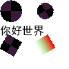

### 子项目一览

- `share.mirai`: 为[mirai-fleet-framework](https://github.com/hundun000/mirai-fleet-framework)框架内的插件提供Function。

- `plugin`: 可打包出mirai-fleet-framework插件，简单验证`share.mirai`的Function。
- `share.block`: 使用[petpet项目](https://github.com/Dituon/petpet)提供的工具，在本地按照`Block模板配置`生成图片。不依赖mirai，只是省事放在同一个子项目里。

### 子项目share.block

#### 输出样例

- 圆形裁剪、旋转

- 矩形涂色、文字

- 随机选择图片并组合

